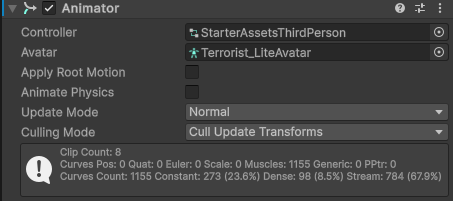

Used the "StarterAssetsThirdPerson" Controller and used "Terrorist_LiteAvatar" for the Avatar.

More animator can be found [here](https://docs.unity3d.com/2023.2/Documentation/Manual/class-Animator.html).