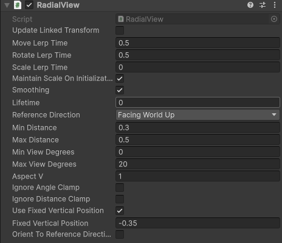

Radial view uses the reference provided by the [Solver Handler](../Solver Handler) to change the position of the object it's attached to. The current example shown below is the [UI](../../UI/UI).

  

