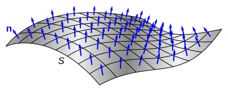
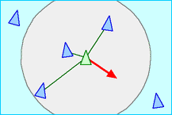
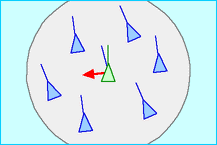
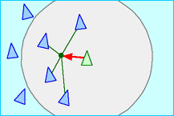

# Welcome to HoloLens 2 Demo Documentation

The documentation contains information to replicate the project. It has the hierarchy and thought process of what the components attached to the objects are meant to do.

For someone who hasn't setup their HoloLens environment start at [Setting Up the Environment](../Unity/Setting Up the Environment). 

### Reproducing the application 

 1. Used the example scene "Scene Understanding" from running MixedRealityFeatureTool.exe and installing Mixed Reality Toolkit Examples
 
 2. Keep the just the UI and remove the scene description panel

 3. Create script components for each button on the UI and attach it to an [Empty Object Named Scripts](../Unity/UI/Empty Object Named Scripts)

 4. [Toggle Enemy](../Unity/Enemy Scripts/Toggle Enemy) script should retrieve data from "OpenXR Spatial Mesh Observer" and when on uses the mesh data to randomly find a normal vector point up from the mesh to spawn an enemy

 5. Enemy prefab contains [Random Movement](../Unity/Enemy Scripts/Random Movement), which control the movement of the enemy

 

 [Toggle Drone](../Unity/Drone Scripts/Toggle Drone) script instantiates a given number of drones and each drone has a [Drone Boid](../Unity/Drone Scripts/Drone Boid) script, which controls the spacing and targeting

    

        Separation 				 Alignment  			       Cohesion 

Versions and progress can be found in "[Version](../Unity/Version)".

The site can be shared easily with this tinyurl, "[https://tinyurl.com/Holo2Demo](https://tinyurl.com/Holo2Demo)".
